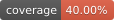

# Customized Stacked Hourglass Network (HGNet) for in-bed pose estimation using RGB-D images
<p style="text-align:center;">
<a href="https://github.com/Vegnics/HourglassNet_RGBD" alt="Python"></a>
<a href="https://github.com/Vegnics/HourglassNet_RGBD/releases" alt="Releases"></a>
<a href="https://github.com/Vegnics/HourglassNet_RGBD/blob/main/LICENSE" alt="Licence"></a>
</p>
<p style="text-align:center;">
<a href="https://github.com/Vegnics/HourglassNet_RGBD/commits" alt="Stars"></a>
<a href="https://github.com/Vegnics/HourglassNet_RGBD" alt="Repo Size"></a>
<a href="https://github.com/Vegnics/HourglassNet_RGBD" alt="Issues"></a>
<a href="https://github.com/Vegnics/HourglassNet_RGBD" alt="Pull Requests"></a>
<a href="https://github.com/Vegnics/HourglassNet_RGBD" alt="Downloads"></a>
</p>
<p style="text-align:center;">
<a href="https://github.com/Vegnics/HourglassNet_RGBDactions" alt="Build Status"></a>
<a href="https://github.com/Vegnics/HourglassNet_RGBD/actions" alt="Test Status"></a>
<a href="https://github.com/Vegnics/HourglassNet_RGBD/actions" alt="Publish Status"></a>
</p>
<p style="text-align:center;">
<a href="https://github.com/Vegnics/HourglassNet_RGBD" alt="Tests"></a>
<a href="https://github.com/Vegnics/HourglassNet_RGBD" alt="Coverage"></a>
<a href="https://github.com/Vegnics/HourglassNet_RGBD" alt="Flake8"></a>
</p>
<p style="text-align:center;">
<a href="https://github.com/Vegnics/HourglassNet_RGBD/stargazers" alt="Stars"></a>
<a href="https://github.com/Vegnics/HourglassNet_RGBD" alt="Forks"></a>
<a href="https://github.com/Vegnics/HourglassNet_RGBD/watchers" alt="Watchers"></a>
</p>

Collaborative project between **NTU** _(National Taiwan University)_ **CSIE DCCV-Lab** and NDHU _(National Dong Hwa University)_. The project addresses Human Pose Estimation and Action Recognition under in-bed settings. The repository includes a reimplementation of _A.Newell et Al_, [_**Stacked Hourglass Network for Human Pose Estimation**_](https://arxiv.org/abs/1603.06937) using **TensorFlow 2** (based on [**Walid Benbihi's**](https://github.com/wbenbihi/hourglasstensorflow) implementation). Additionally, novel attention mechanisms (spatial and feature domain) have been incorporated into the Residual Modules comprising the main blocks of the HGNet.
In short, the core contributions of the project include:

- **Addition of novel attention mechanisms**: A third branch (attention branch) is incorporated within the Residual Modules comprising the core Hourglasses. Attention is applied in a soft-way (i.e. attention scores cannot suppress features). Ablations are proposed to prove the performance boost achieved by the proposed attention scheme. 
-  **Stage specific ground-truth**: Conversely to using the same ground-truth for all the stages as done in previous works, the ground-truth heatmaps adopted to train the models in this project regards the location of an Hourglass (stage) within the whole model. 
- **Light-weight models for in-bed pose estimation**: Within in-bed settings, models of $~7.5M$ parameters are suficient to achieve an accuracy comparable with larger models.

- **Heatmap-based in-bed action recognition**: The heatmaps generated with the proposed models are used within a sequence-based in-bed action recognition (BedAR) model ($\leq 8M$ params).  


The models can be trained on:
  * [**MPII Human Pose Dataset**](http://human-pose.mpi-inf.mpg.de/)
  * [**SLP Multimodal in-bed pose estimation dataset**](https://ostadabbas.sites.northeastern.edu/slp-dataset-for-multimodal-in-bed-pose-estimation-3/).
  * [**MKV RGB-D Human Pose Dataset** ](https://lmb.informatik.uni-freiburg.de/resources/datasets/KinectDatasets.en.html)

Currrently, the framework for training in-bed pose estimation models regard **RGB**, **depth**, and **RGB-D** modalities. 

### Getting started 
------------------------
1. Customize the training configuration file:
```python
#scripts/config_generation/train_config_generator.py

# Related to the data and dataset
modality = "Depth" # It could be "RGB", "RGBD", "Depth"

dataset_path = "path/to/dataset"
annotations_path = "path/to/annotations/json/file.json"


# Related to the ground truth data
n1joints = 14
n2joints = 12
use2joints = False
heatmap_stddev =  1.1
stddev_factor = 1.3
limbs_2J = ...
enable_visibility = True

# Related to the model and training
model_name = "path/to/models/checkpoint.keras"
chkpnt_path = os.path.join("data/model_t",model_name)
csv_logger = f"logs/myModelLogs_{model_name}_{current_time}.csv"
epochs = 150
batch_size = 20
stages = 2
stage_filters = 256
residual_nblocks = 1
learning_rate = 2.5e-4

# Related to loading pre-trained models
load_model = True
pt_model_name = "model/path.keras"
loading_mode =  "Full_Train" 

#Related to the attention mechanisms
skip_AM = "NoAM"
s2f_AM =  "FAM" 
f2s_AM = "NoAM" 

#Related to the loss
W_1jnts = 1.0
W_2jnts = 0.2 
W_coords = 0.1
```
2. Generate the *Config* file:
```
$ python scripts/config_generation/train_config_generator.py
```
3. ...

**[UNDER DEVELOPMENT]**
